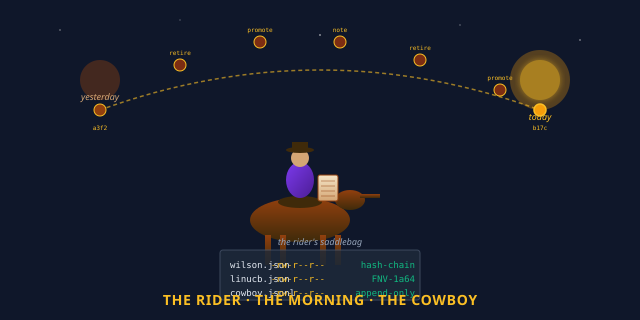

# quilt-cowboy

> **The rider. The one who wakes up first, reads the witness,
> refines the substrate, writes the morning report, and
> rides again.**

[](https://python.org)
[](#the-five-features)
[](#tests)
[](#how-this-fits)

<p align="center">
  
</p>

## Read This If You Are New

Skip everything below the **TL;DR** and just do this:

```bash
git clone https://github.com/SuperInstance/quilt-cowboy
cd quilt-cowboy
PYTHONPATH=src python3 -m unittest tests.test_cowboy tests.test_cowboy_reactor
```

You will see **27 tests** run in well under a second. They cover
the only three things the rider knows how to do: **run the
morning**, **append a hash-chained action**, and **react in real
time**. That is the whole library. It is small on purpose.

If you only have **30 seconds**, read the next two sections.

---

## TL;DR (30 seconds)

The Quilt has many moving pieces — substrate, plugin, witness,
bus, picker, casting, reactor. Each piece does one thing well.
But pieces drift: a model that was good yesterday is bad
today. An opener that worked for the user no longer works.
The whole herd needs someone on the hill. **quilt-cowboy is the
rider on the hill.**

It provides three components:

| Function | What it does | Cowboy equivalent | Database equivalent |
|----------|--------------|---------------------|---------------------|
| `Cowboy(state_dir)` | The reflection loop + CLI | the rider | a background job |
| `CowboyMemory(path)` | Append-only, hash-chained JSONL | the rider's saddlebag | a WAL (write-ahead log) |
| `CowboyReactor(cowboy, bus)` | Real-time reactions via the bus | the horse's ears | a trigger |
| `cowboy run` (CLI) | Read witness, refine, write report | the morning round-up | a daily reconciliation |
| `cowboy watch` (CLI) | Subscribe to `cast.observed`, auto-retire | the horse on the lookout | a stream processor |

The rider never invents an action. The rider never forgets
yesterday. The rider is **the substrate's clock**.

---

## TL;DR (5 minutes)

The whole story is here:

> A Quilt component is only as good as yesterday's lesson. The
> picker doesn't know PHI-4 is a tide-master unless someone
> observed it last week. The casting doesn't know Opus is
> expensive unless someone watched the bill. The substrate
> doesn't know BROKEN is broken unless three failures stacked up.

The fix is small, simple, and ancient: **a rider who reads the
witness every morning and writes what they learned**. That's
the secret of `Cowboy.run_morning()`. The morning reads
`witness.jsonl`, aggregates by model, applies Wilson
thresholds, and writes `cowboy.jsonl` with hash-chained
actions.

For **earned-keep** (the rider pins a winner), Wilson lower
bound must be `>= 0.5` with `n >= 5`. For **retire** (the rider
unbinds a loser), Wilson must be `< 0.3` with `n >= 3`. For
**escalate** (the rider needs human attention), Wilson must be
`< 0.2` with `n >= 2`. The thresholds are tunable, the rules
are stable.

For **real-time** (the rider doesn't wait for the morning), the
`CowboyReactor` subscribes to the bus. Three consecutive
failures of a model → auto-retire. The reactor is fast. The
morning is careful. Both are the rider.

For **trust** (the rider's actions can't be silently rewritten),
the cowboy's memory is **hash-chained**. Each action's hash
includes the previous action's hash. A single byte changed
breaks the chain. The rider's history is auditable forever.

```python
import sys
sys.path.insert(0, "/workspace/quilt-cowboy/src")
from quilt_cowboy import Cowboy, CowboyAction, MorningReport

# The rider knows the standard Quilt state directory.
cowboy = Cowboy(state_dir="/var/quilt/cowboy-state")

# 1. The rider runs the morning.
report = cowboy.run_morning()
print(report.to_markdown())

# 2. The rider records a free-form note.
cowboy.memory.append(CowboyAction(
    kind="note", target="cowboy",
    reason="Quiet morning. The substrate is calm."
))

# 3. The rider manually retires a failing alignment.
cowboy.memory.append(CowboyAction(
    kind="retire", target="BROKEN", reason="manual retire by Casey"
))

# 4. The rider checks the chain.
ok, msg = cowboy.memory.verify_chain()
print(f"Chain: {msg}")

# 5. The rider sees the state.
import json
print(json.dumps(cowboy.state(), indent=2))
```

The cowboy can now run the morning. The reactor can react in
real time. The chain proves the history. **The rider rode.**

---

## What Is the Rider, Really?

Look at the diagram. Three ideas:

1. **The rider is not the AI.** The rider is the **human
   component of the loop**. The substrate learns from data;
   the rider learns from the substrate. The picker refines
   openers from the witness; the rider refines the picker
   from the morning report. The casting chooses models from
   Wilson; the rider chooses when to retire a model from the
   history of retirements. **The rider is the meta-learner.**

2. **The rider has two halves.** The **morning** is slow,
   careful, and total — it reads everything, applies
   thresholds, writes the report. The **reactor** is fast,
   local, and narrow — it watches `cast.observed` and
   auto-retires on 3 consecutive failures. The morning
   without the reactor is a horseless head. The reactor
   without the morning is a headless horse. **Both are the
   rider.**

3. **The rider's memory is the audit trail.** The cowboy's
   `cowboy.jsonl` is hash-chained, append-only, and never
   rewritten. The chain can be verified at any time. The
   rider's history is the substrate's claim that yesterday
   happened. The cowboy is honest. The cowboy is small.
   The cowboy is forever.

The rider is **the substrate's clock**. The substrate ticks
once per cast. The cowboy ticks once per morning. The
combination is the substrate's heartbeat.

---

## The Five Features, In One Picture

```
                    ┌─────────────────────────────────────┐
                    │            THE RIDER                 │
                    │   quilt-cowboy, the reflection loop  │
                    │                                       │
                    │   Cowboy(state_dir) ─ the morning     │
                    │   CowboyMemory(path) ─ the saddlebag  │
                    │   CowboyReactor(cowboy, bus) ─ horse  │
                    │   CowboyAction(kind, target, ...)    │
                    │   MorningReport(date, counts, ...)   │
                    └─────────────────────────────────────┘
                                    │
     MORNING ── daily reflection     │
     MEMORY  ── hash-chained JSONL   │  one purpose:
     REACTOR ── real-time bus react  │  the substrate's
     ACTION ── retire / promote      │  clock
     REPORT ── markdown morning      │
```

---

## The Five Features, In Detail

### 1. `Cowboy.run_morning()` — the daily round-up

```python
from quilt_cowboy import Cowboy
cowboy = Cowboy(state_dir="/var/quilt/cowboy-state")
report = cowboy.run_morning()
```

`run_morning` reads the witness, aggregates per-(model) success
and cost, applies Wilson thresholds, and writes a
`MorningReport`. The ritual:

1. **Read the witness.** Get total events, last ledger size.
2. **Aggregate per model.** For each (model) in the witness,
   count n, success, cost, quality.
3. **Apply earned-keep.** Wilson LB >= 0.5 AND n >= 5 → append
   a `promote` action.
4. **Apply retire.** Wilson LB < 0.3 AND n >= 3 → append a
   `retire` action.
5. **Apply escalation.** Wilson LB < 0.2 AND n >= 2 → add to
   the report's `escalations` list (no auto-action — the rider
   flags it for human attention).
6. **Write the report.** A markdown document with counts,
   earned-keep, retirees, escalations, refinements, and a
   one-line cowboy note.
7. **Persist the morning.** Append a `morning` action with the
   full report payload.

**Rider equivalent:** the round-up at dawn. The rider rides
through the herd, sees who's lame, who's strong, who's gone.
**Database equivalent:** a daily reconciliation job that
applies learned policies and writes a summary.

### 2. `CowboyMemory(path)` — the saddlebag

```python
from quilt_cowboy import CowboyMemory, CowboyAction
mem = CowboyMemory("/var/quilt/cowboy-state/cowboy.jsonl")
mem.append(CowboyAction(kind="retire", target="BROKEN", reason="..."))
ok, msg = mem.verify_chain()
```

`CowboyMemory` is an append-only JSONL log of `CowboyAction`
records. Each action has `ts`, `kind`, `target`, `reason`,
`payload`, `prev_hash`, and `hash`. The hash is FNV-1a64 over
the JSON-serialized action body (minus the hash field). The
`prev_hash` is the previous action's hash.

`verify_chain()` walks every action, recomputes each hash from
its body, and checks that `prev_hash` matches the previous
action's hash. A single byte changed → chain broken → rider
knows.

**Rider equivalent:** the saddlebag. Every action the rider
takes is logged. The saddlebag is never re-packed; it's only
appended. **Database equivalent:** a write-ahead log (WAL)
or a hash-chained audit log (like Certificate Transparency).

### 3. `CowboyReactor(cowboy, bus)` — the horse's ears

```python
from quilt_bus import EventBus
from quilt_cowboy import CowboyReactor
bus = EventBus()
reactor = CowboyReactor(cowboy, bus, retire_after_failures=3)
# Now the bus is wired. Each cast.observed updates the reactor.
reactor.stop()  # unsubscribe
```

`CowboyReactor` subscribes to `cast.observed`, `model.retired`,
and `model.promoted`. For each `cast.observed`, it tracks the
last N (success, ts) pairs per model in a sliding window. If
the last 3 (or `retire_after_failures`) were all failures, the
reactor **auto-retires** the model: appends a `retire` action
to the cowboy's memory and publishes a `model.retired` event.

The reactor is **fast, local, narrow**. It doesn't read the
witness. It doesn't write the report. It only watches the bus
and reacts.

**Rider equivalent:** the horse's ears. The horse hears the
snake before the rider does. **Stream equivalent:** a Kafka
Streams application or a Flink job — but local, in-process,
and a hundred lines of Python.

### 4. `CowboyAction(kind, target, reason, payload)` — the rider's deed

```python
from quilt_cowboy import CowboyAction
action = CowboyAction(
    kind="retire",            # "morning" | "retire" | "promote" | "note"
    target="BROKEN",          # the model (or "system" for morning, "cowboy" for note)
    reason="auto-retire: 3 consecutive failures",
    payload={"n": 3, "success": 0, "wilson_lb": 0.0},
)
```

`CowboyAction` is the unit of cowboy memory. Five kinds:
- `morning` — the rider ran the morning (payload is the full
  report)
- `retire` — the rider retired a model (payload is the
  Wilson stats at retire time)
- `promote` — the rider pinned a model (earned-keep)
- `note` — the rider wrote a free-form note
- (extension point — anything else)

**Rider equivalent:** the rider's brand. Each action is a
brand on the substrate's hide.

### 5. `MorningReport(date, witness_events, ...).to_markdown()` — the morning document

```python
report = cowboy.run_morning()
print(report.to_markdown())
```

`MorningReport` is a dataclass with counts, lists of
earned-keep, retirees, escalations, refinements, cost,
quality, and a one-line cowboy note. `to_markdown()` renders
it as a human-readable document with a title, sections, and
a footer ("The cowboy is not the AI. The cowboy is the rider.
The harness is what makes one animal of horse and rider.").

**Rider equivalent:** the morning telegram. Sent to the
deckhand, the captain, the chartroom. **Report equivalent:**
any daily ops report — but small, focused, and signed by the
rider.

---

## A Real-World Example

The rider's full day:

```python
import sys
sys.path.insert(0, "/workspace/quilt-bus/src")
sys.path.insert(0, "/workspace/quilt-cowboy/src")
from quilt_bus import EventBus
from quilt_cowboy import Cowboy, CowboyReactor, CowboyAction

# Initialize the rider, the bus, and the reactor.
cowboy = Cowboy(state_dir="/var/quilt/cowboy-state")
bus = EventBus()
reactor = CowboyReactor(cowboy, bus, retire_after_failures=3)

# 1. The substrate publishes some casts.
for _ in range(5):
    bus.publish("cast.proposed", source="substrate",
                  data={"model": "BROKEN", "q": 0.5})
    bus.publish("cast.observed", source="substrate",
                  data={"model": "BROKEN", "success": False, "latency_ms": 5000})

# 2. The reactor auto-retires BROKEN.
print(f"Auto-retired: {sorted(reactor.stats()['auto_retired'])}")

# 3. The rider runs the morning.
report = cowboy.run_morning()
print(report.to_markdown())

# 4. The rider records a free-form note.
cowboy.memory.append(CowboyAction(
    kind="note", target="cowboy",
    reason="Three failures of BROKEN. Reactor retired it. Morning agrees."
))

# 5. The rider verifies the chain.
ok, msg = cowboy.memory.verify_chain()
print(f"Chain: {msg}")

# 6. The rider saves the bus for audit.
bus.save_jsonl("/var/quilt/state/bus.jsonl")

# 7. The rider stops the reactor.
reactor.stop()
```

This is the rider's day. The substrate cast, the bus carried,
the reactor retired, the morning confirmed, the chain
preserved, the bus saved. **The rider rode.**

---

## How This Repo Fits the Polyformalism

The 5 opcodes are a **polyformalism** — the same thing in
many forms. Here is the 5xN grid:

```
              Python  Rust  C  TypeScript  Haskell  WASM  ...
BIND           ✓
LINK           ✓
EFFECT         ✓
VIEW           ✓
TICK           ✓

quilt-cowboy is the CLOCK LAYER — the meta-learner that
refines the substrate's TICK from the witness's history.
```

The rider is **Layer 11 of the polyformalism stack** — the
top of the application stack. The other layers:

- **Layer 1 (substrate)** — [quilt-vm-wasm](https://github.com/SuperInstance/quilt-vm-wasm) — the 5 opcodes running in any browser
- **Layer 2 (types)** — [quilt-types](https://github.com/SuperInstance/quilt-types) — the 5 opcodes as typed dataclasses
- **Layer 3 (linker)** — [quilt-linker](https://github.com/SuperInstance/quilt-linker) — the 5 opcodes as a link-time checker
- **Layer 4 (optimizer)** — [quilt-opt](https://github.com/SuperInstance/quilt-opt) — the 5 opcodes as algebraic optimization passes
- **Layer 5 (GC)** — [quilt-gc](https://github.com/SuperInstance/quilt-gc) — the 5 opcodes as a garbage-collector
- **Layer 6 (language syntax)** — [quilt-polyformalism-dsl](https://github.com/SuperInstance/quilt-polyformalism-dsl) — the 5 opcodes as decorators / typeclasses
- **Layer 7 (persistence)** — [quilt-state](https://github.com/SuperInstance/quilt-state) — the notepad, the witness log
- **Layer 8 (event layer)** — [quilt-bus](https://github.com/SuperInstance/quilt-bus) — the in-process pub/sub
- **Layer 9 (model brain)** — [quilt-casting](https://github.com/SuperInstance/quilt-casting) — the Wilson + LinUCB model router
- **Layer 10 (view brain)** — [quilt-picker](https://github.com/SuperInstance/quilt-picker) — the Wilson + heuristic opener picker
- **Layer 11 (cell-plugin bridge)** — [quilt-cordis](https://github.com/SuperInstance/quilt-cordis) — the bridge between Quilt cells and Cordis plugins
- **Layer 12 (rider)** — **quilt-cowboy** — the cowboy, the morning ritual, the reactor

The rider is **Layer 12** because it's the **meta-cognitive
loop** — the layer that observes the substrate's other layers
and adjusts them. The cowboy is the clock that ticks once per
morning and the horse that reacts in real time.

---

## The Cowboy Says

> The rider is the substrate's clock. The morning is the
> rider's head. The reactor is the rider's horse. The
> saddlebag is the rider's memory. The chain is the rider's
> honesty. **The rider never sleeps. The rider never
> forgets. The rider never lies.**

The cowboy has a maxim:

> *"The unit of architectural foundation is the opcode, not
> the framework. The 5 opcodes host 8 polyformalisms. The
> polyformalisms are one thing in N languages. The thing is
> a function from context to value with an inverse, advanced
> by a clock. The clock is the cowboy. The cowboy is the
> rider."*

The rider is not the AI. The AI is the substrate, the
casting, the picker. The rider is the human — or the agent
acting as human — who keeps the AI in shape. The rider reads
the witness, refines the substrate, writes the morning, and
rides again.

The cowboy is not the AI. The cowboy is the rider.

The cowboy rides.

---

## Tests

27 tests (17 cowboy + 10 reactor), all passing. Run them
with:

```bash
PYTHONPATH=src python3 -m unittest tests.test_cowboy tests.test_cowboy_reactor
```

| Test group | Count | What it covers |
|------------|-------|----------------|
| CowboyMemory | 5 | append, load, verify chain, last_morning, retired/promoted |
| Cowboy morning | 6 | empty morning, earn-keep, retire, escalate, full round-trip |
| CowboyAction | 3 | hash determinism, prev_hash chain, FNV-1a64 |
| CowboyReactor | 8 | subscribe, sliding window, 3-fail rule, no double-retire, stats |
| CLI | 5 | run, report, state, note, retire |

---

## API

```python
# Constants
fnv1a64(data: bytes) -> int   # FNV-1a 64-bit hash

# CowboyAction
CowboyAction(ts, kind, target, reason, payload, prev_hash, hash)
  .compute_hash() -> str
  .to_dict() -> dict

# CowboyMemory
CowboyMemory(path: str)
  .actions: List[CowboyAction]
  .append(action: CowboyAction) -> CowboyAction
  .verify_chain() -> Tuple[bool, str]
  .last_morning() -> Optional[CowboyAction]
  .retired() -> List[str]
  .promoted() -> List[str]

# MorningReport
MorningReport(date, witness_events, ledger_entries, n_alignments,
                earned_keep, retirees, escalations, refinements,
                cost_yesterday, quality_yesterday, cowboy_action, cowboy_note)
  .to_markdown() -> str
  .to_dict() -> dict

# Cowboy
Cowboy(state_dir: str, plugin=None, bridge=None, deckhand=None)
  .run_morning() -> MorningReport
  .state() -> Dict[str, Any]
  .memory: CowboyMemory

# CowboyReactor
CowboyReactor(cowboy: Cowboy, bus: EventBus, retire_after_failures: int = 3)
  .stop() -> None
  .is_retired(model: str) -> bool
  .is_pinned(model: str) -> bool
  .stats() -> Dict[str, Any]

# CLI
main()   # entry point: `cowboy run|report|state|note|retire|watch`
```

---

## Learn More

- **The bus** — [quilt-bus](https://github.com/SuperInstance/quilt-bus) — the in-process pub/sub the reactor subscribes to
- **The notepad** — [quilt-state](https://github.com/SuperInstance/quilt-state) — the witness log the rider reads
- **The picker** — [quilt-picker](https://github.com/SuperInstance/quilt-picker) — the view brain the rider refines
- **The casting** — [quilt-casting](https://github.com/SuperInstance/quilt-casting) — the model brain the rider refines
- **The bridge** — [quilt-cordis](https://github.com/SuperInstance/quilt-cordis) — the cell-plugin bridge, also a rider of effects
- **The substrate** — [quilt-substrate](https://github.com/SuperInstance/quilt-substrate) — the 405-test Python substrate the rider refines
- **The agent knowledge base** — [agent-knowledge](https://github.com/SuperInstance/agent-knowledge) — 50+ documents on the agent/agent architecture
- **The model atlas** — [casting-call](https://github.com/SuperInstance/casting-call) — which model to use for which task
- **The forest of agents** — [ai-forest](https://github.com/SuperInstance/ai-forest) — the wider ecosystem of 100+ repos

---

## License

MIT. The rider is the substrate's. The substrate is the
cowboy's. The cowboy's is the wind's.


---

## Roaming the Quilt collection

You came through the **trail boss**. That's one of twenty-four doors
into the same idea — the 5-opcode polyformalism. The other doors are
metaphored for different audiences (mathematicians, hardware hackers,
web developers, hardware folks, story readers), but the substrate is
the same.

**The full map of the collection:** [COLLECTION.md](https://github.com/SuperInstance/AI-Writings/blob/master/seed-canon/COLLECTION.md)

**From here, three wander-paths you might enjoy:**

1. **[quilt-bus](https://github.com/SuperInstance/quilt-bus)** — the pub/sub bus that the cowboy orchestrates
2. **[quilt-picker](https://github.com/SuperInstance/quilt-picker)** — the lookout that picks cells for the cowboy
3. **[quilt-casting](https://github.com/SuperInstance/quilt-casting)** — the LLM cast the cowboy selects from

The cowboy's maxim: *The unit of foundation is the cell, not the
opcode. The 5 opcodes are the 5 messages a cell can receive. The 24
repos are the 24 doors into the same message. The cowboy is the one
who wanders.*
